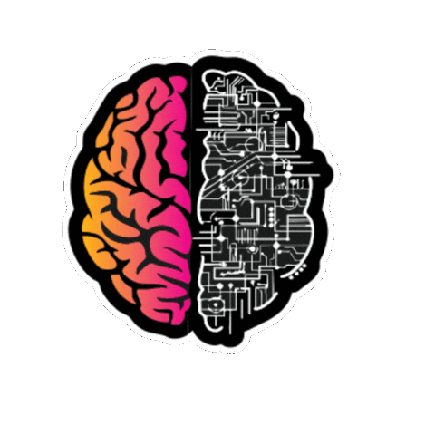

<h1 align="center">Hey, Soy Darío Chacón </h1>

## <picture></picture> Sobre mí

<picture>
  
</picture>

- 🎯 Desarrollador Multiplataforma con background en Java.
- 🛡️ En transición hacia la ciberseguridad ofensiva: pentesting, análisis y explotación de vulnerabilidades y Red Team.
- 🧪 Me gusta el desarrollo, ya sea de herramientas o exploits, romper sistemas y documentar lo aprendido.
- 📚 Actualmente en formación con [ZERO DAY](https://www.clubzeroday.com/black/).
- 🚀 Siempre aprendiendo, siempre iterando.

 

- Contacto: <a href="https://www.linkedin.com/in/dariochaconp" target="_blank">  

## <picture></picture> Proyectos
## 🛡️ Ciberseguridad
   ### 🔧 Herramientas
   🚧 En construcción - Próximamente scripts de automatización
   
   ### 💣 Exploits
   🚧 En construcción - Desarrollando POCs educativos
   
   ### 🕵️ CTFs
   🚧 En construcción - Documentando writeups

 

## 💻 Programación
### 🖥️ Web
<!--  [Portfolio Terminal](https://github.com/DCh4con/portfolio-terminal) — Portfolio estilo terminal con estética Red Team.   

Sitio Web: https://dch4con.github.io/portfolio-terminal 
-->

  <table border="0" style="border:none;">
    <tr>
      <td width="33%" style="border:none;">
        <!-- TARJETA 1 -->
        
         
        <a href="https://dch4con.github.io/portfolio-terminal">Sitio Web</a>
      </td>
    </tr>
  </table>

 

 

_(La lista se irá actualizando conforme vaya creando mas proyectos)_

 

## <picture></picture> Stack Tecnológico

### 🛡️ Ciberseguridad (Herramientas)

   
   
   
  
  
   
  

### 💻 Sistemas Operativos

  
  
  

### 🧩 Lenguajes 

 
   
   
   
   

 

### 🗄️ Bases de Datos

  

### 🛠️ Herramientas de Desarrollo 

 
  
   

 

## <picture></picture>Experiencia en Ciberdelincuencia

 
  <picture></picture>

  <i>404: Black Hat Career not found.</i>

<!-- ## <picture></picture> Estadísticas

 
-->
